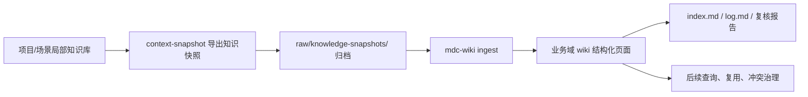

# 知识沉淀工作流｜Local Knowledge to Domain Wiki

## 定位

本页定义团队将项目、场景中的局部知识，持续汇总到业务域知识库的标准流程。

核心思想是：
每个项目先在自己的上下文中沉淀知识，再通过“自包含知识快照”进入业务域 wiki。业务域 wiki 不直接绑定每个项目的内部目录、代码结构或个人写作习惯。

## 适用范围

适用于以下场景：

- 数据开发项目沉淀表、字段、规则、指标、字典和 SQL 口径
- 业务试点场景沉淀规则、流程、例外、问答和验证案例
- 多个项目需要把局部经验汇入同一个业务域知识库
- 同一规则、指标、对象可能在多个项目中重复出现、变体出现或产生冲突

不适用于以下场景：

- 一次性临时分析，不需要长期复用
- 只需要提交代码，不需要沉淀业务或数据知识
- 尚未形成稳定事实，只是探索性草稿

## 核心对象

### 局部知识库

局部知识库是项目或场景自己的知识沉淀空间。

它可以存在于项目仓库、场景目录、个人工作台或团队共享目录中。它的结构可以根据项目实际情况设计，不要求和业务域 wiki 完全一致。

对数据项目，推荐至少沉淀：

- `context/tables.md`：表、视图、字段、关联路径、平台约束
- `context/rules.md`：业务规则、指标口径、SQL 逻辑、计算边界
- `context/dictionary.md`：枚举、编码、字段语义、名称清洗规则

### 业务域知识库

业务域知识库是某个业务域的长期知识底座。

本项目就是零售业务与数据协同领域的业务域 wiki。它通过 `SCHEMA.md`、`index.md`、`log.md`、`raw/` 和各类结构化页面维护可追溯、可检索、可增量更新的知识。

### 知识快照

知识快照是局部知识库交付给业务域 wiki 的标准输入物。

它必须是自包含的 markdown 文件，即使业务域 wiki 不能访问原项目仓库，也能理解其中的表、规则、字典、来源、版本和变化。

数据项目默认使用 `context-snapshot` skill 导出知识快照。

### Ingest

Ingest 是业务域 wiki 吸收知识快照的过程。

它不是简单复制，也不是重新总结，而是先完整归档快照，再根据 `SCHEMA.md` 提升稳定、可复用、可链接的知识页面。

## 总体流程



## 阶段一：在项目中沉淀局部知识

项目成员应先在项目自己的上下文里沉淀知识，不要一开始就强行写进业务域 wiki。

局部知识库允许贴近项目实际：

- 数据项目可以围绕 `context/tables.md`、`context/rules.md`、`context/dictionary.md`
- 场景项目可以围绕场景流程、业务规则、验证案例、交付口径
- 研究型项目可以围绕来源材料、方法、假设、结论和待确认问题

局部知识库的最低要求：

- 事实边界清楚，能说明哪些文件是唯一事实源
- 表、规则、指标、字典等对象有稳定 ID 或稳定名称
- 关键 SQL、口径、映射、例外和 caveat 不应只留在口头沟通中
- 同一项目内的重复与冲突应尽量先暴露出来
- 不能把模板占位符、教学示例、空壳条目当作真实知识

## 阶段二：导出知识快照

当项目知识需要进入业务域 wiki 时，先用 `context-snapshot` 导出知识快照。

技能路径：

```text
D:\Dropbox\Project\my-skills\context-snapshot\SKILL.md
```

数据项目推荐命令模式：

```powershell
$p = Get-Item -LiteralPath 'D:\path\to\data_project'
python D:\Dropbox\Project\my-skills\context-snapshot\scripts\export_context_snapshot.py --project-root $p.FullName
```

知识快照必须满足：

- 一个导出动作只生成一个主要 markdown 文件
- 默认只使用项目声明的 canonical context 文件作为事实源
- 保留完整事实，不把详细规则压缩成一句话
- 对每个表、规则、字典保留 `结构化事实` 和 `原始事实摘录`
- 记录 `project_id`、`snapshot_id`、`source_content_hash`、`source_commit`
- 记录与上一快照的差异，包括新增、更新、未变、移除
- 只在项目内部做去重，不替业务域 wiki 裁决跨项目冲突

## 阶段三：导入业务域 wiki

业务域 wiki 使用 `mdc-wiki` ingest 知识快照。

技能路径：

```text
D:\Dropbox\Project\my-skills\mdc-wiki\SKILL.md
```

导入步骤：

1. 将完整知识快照归档到 `raw/knowledge-snapshots/<project-id>/`
2. 保持 raw 快照不可变，不在 raw 中改错或补解释
3. 读取快照的 manifest、结构导览、关系索引、版本差异
4. 按 `SCHEMA.md` 判断哪些知识应提升为结构化页面
5. 数据对象进入 `tables/`
6. 业务规则和指标口径进入 `rules/`
7. 跨页面复用的抽象术语进入 `concepts/`
8. 稳定外部对象、平台、渠道、指数、供应商进入 `entities/`
9. 项目入口、导入说明、端到端流程进入 `scenarios/`
10. 高价值复核结论进入 `queries/`
11. 更新 `index.md`
12. 追加 `log.md`
13. 生成或更新导入报告

导入原则：

- 业务域 wiki 只依赖知识快照，不直接依赖项目仓库内部结构
- 不把每个快照机械拆成大量页面，只提升稳定、可复用、值得检索的知识
- 对同名规则、同名表、同名指标不直接覆盖，应保留来源、项目、版本和冲突状态
- 如果一次 ingest 会影响大量已有页面，应先确认范围

## 阶段四：复核导入质量

每次导入完成后，至少复核以下项目：

- raw 快照是否存在且路径正确
- 导入页面数量是否与快照结构一致
- 新增或更新页面是否有 frontmatter
- `tags` 是否符合中文命名空间标签体系
- `sources` 是否指向 raw 快照
- `index.md` 是否登记新增入口
- `log.md` 是否记录动作、来源、规模和版本
- wikilink 是否断链
- 是否出现只有引用、没有真实事实的占位页面
- 是否存在需要抽取到 `concepts/` 或 `entities/` 的重复语义

复核结论如果未来可能复用，应沉淀到 `queries/`。

示例：

- [[queries/营销域数据分析项目知识快照导入报告]]

## 阶段五：增量演进

知识沉淀不是一次性导入，而是反复迭代。

当项目继续推进时，应重新生成新的知识快照。业务域 wiki 根据快照差异进行增量更新：

- `new`：新增页面或补充到已有页面
- `updated`：更新已有页面并保留版本来源
- `unchanged`：不重复写入，必要时只更新导入记录
- `removed`：不要直接删除旧知识，应标记为过期、替代或移入 `_archive/`
- `conflict`：保留冲突双方来源，必要时建立 `comparisons/` 或待确认页

业务域 wiki 的长期目标不是堆积快照，而是逐渐形成稳定的 canonical knowledge。

## 角色分工

### 项目负责人

- 维护项目自己的局部知识库
- 确认事实源边界
- 负责项目内规则、表、字典的准确性
- 在导出前清理模板占位符和明显噪音

### 知识快照执行 agent

- 按 `context-snapshot` skill 导出快照
- 使用脚本而不是自由总结
- 不扩大事实源范围，除非用户明确要求
- 输出可独立理解、可追溯、可比较的快照

### 业务域 wiki 维护 agent

- 按 `mdc-wiki` skill 执行 ingest
- 完整归档 raw 快照
- 按 `SCHEMA.md` 更新结构化页面
- 更新 `index.md` 和 `log.md`
- 复核链接、标签、来源和冲突

### 业务域知识维护人

- 维护 `SCHEMA.md`
- 决定跨项目冲突如何治理
- 审视是否需要抽象出 canonical 概念、实体、规则或对比页
- 控制 wiki 的结构质量，避免页面数量无序膨胀

## 关键边界

- 局部知识库可以灵活，业务域 wiki 必须稳定
- 项目知识进入业务域 wiki 的标准输入是知识快照，不是项目仓库本身
- `context-snapshot` 负责把局部知识变成可导入工件
- `mdc-wiki` 负责把工件吸收进业务域知识库
- 业务域 wiki 不应为每种项目结构编写专用导入适配层
- 知识快照不是 raw 原文的唯一替代物，但它必须足够表达 wiki ingest 所需事实
- 模型可以辅助判断页面落位，但不能压缩或编造快照事实

## 推荐落地节奏

1. 每个团队成员先在自己的项目中建立局部知识沉淀规则
2. 对数据项目优先统一 `context/tables.md`、`context/rules.md`、`context/dictionary.md`
3. 每个成熟项目导出一次知识快照
4. 将知识快照导入业务域 wiki
5. 通过导入报告复核质量
6. 周期性治理跨项目重复、冲突和抽象概念
7. 将稳定模式回写到本页、`SCHEMA.md` 或相关 skill

## 相关页面

- [[SCHEMA]]
- [[index]]
- [[log]]
- [[standards/页面模板]]
- [[scenarios/营销域数据分析项目知识快照导入]]
- [[queries/营销域数据分析项目知识快照导入报告]]
